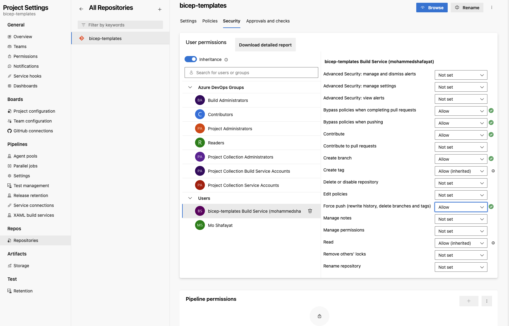

## Azure Devops Instructions

#### NOTE
Only 1 Module at a time can be updated

After a module is updated, go to that module folder (e.g cd ../modules/ai-ml/cognitive-services) and run brm generate

The pipeline will fail to run if either of these steps are missed are skipped/missed.
1. Clone the customer's Devops Repo on your local machine.Add our Github Arinco Repo as second remote repo:
    ```
    git remote add arincoBicepModules https://github.com/arincoau/arinco-bicep-modules.git
    ```
    You may need to authenticate.

2. Run the following command to check the remote repositories:
    ```
    git remote -v
    ```
    Two remote repositories should now be available. The origin should be the customer's Devops Repo.

3. Fetch the content from the Arinco repository:
    ```
    git fetch arincoBicepModules
    ```
    This command fetches all branches from the secondary repository. You can now access these branches locally.

4. Merge a specific branch from the secondary repository into your current branch. In this case, we merge the main branch of the Arinco Bicep Modules:
    ```
    git merge arincoBicepModules/main
    ```

5.  Confirm that you can now see all the Arinco Modules on the local branch. On line 25 of the refresh-module-table.ps1 table, add the customer's Devops Repo Url (e.g https://dev.azure.com/contoso/Contoso/_git/Contoso-Modules?path=/modules )


6. Push the local branch to the customer's Devops Repo:
    ```
    git push -u origin --all
    ```

7. IMPORTANT STEP (DO NOT SKIP): Push the tags to origin:
    ```
    git push origin --tags
    ```

8. For the pipeline to be able to udpate the table in README.MD, modify permissions of the buiild service as shown below.
Go to Project Setting>Repositories>Security

    

----------------------------------------------------------------------------------------------------------------------------------------------
Only 1 Module at a time can be updated

After a module is updated, go to that module folder (e.g cd ../modules/ai-ml/cognitive-services) and run **brm generate**

The pipeline will fail to run if either of these steps are missed are skipped/missed.