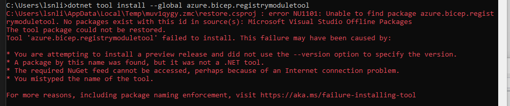
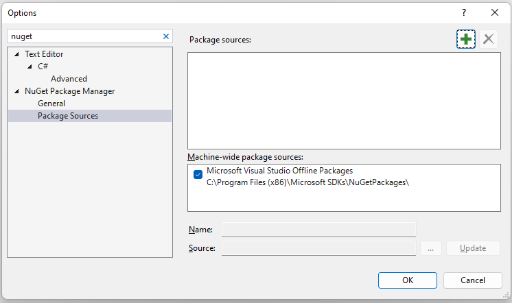

# Contributing to Arinco Bicep Modules

The following instructions help guide you with the development of Arinco Bicep modules.

## Prerequisites

- Install [.NET 6.0 SDK](https://dotnet.microsoft.com/en-us/download/visual-studio-sdks)
- Install the [Bicep registry module](https://www.nuget.org/packages/Azure.Bicep.RegistryModuleTool/) tool by running:
  - `dotnet tool install --global Azure.Bicep.RegistryModuleTool`
- Install the following VSCode extensions as they are used for code formatting:
  - [Bicep](https://marketplace.visualstudio.com/items?itemName=ms-azuretools.vscode-bicep)
  - [Prettier](https://marketplace.visualstudio.com/items?itemName=esbenp.prettier-vscode)

The build and deployment workflows associated with this repository will always use the latest version of bicep. Therefore when contributing, ensure you have the latest version of the Bicep registry module tool and Bicep CLI installed.

To update the Bicep registry module tool, run the following:

- `dotnet tool update --global azure.bicep.registrymoduletool`

In rare occasions where VS studio was installed before .NET framework, the nuget pacakge source configuration can be pointing to the wrong area.  In which case, you will see the following error:



To resolve this, navigate to the nuget options configuration within VS studio as per following diagram:



Add the entry for Nuget API as per the following diagram:


To update the Bicep CLI, run the following:

- `az bicep upgrade`

## Branching

To contribute create a branch off `main`, following the conventions below.

- Branch names are to be all lower case.
- Multiple words are to be separated by `-`, eg. `sql-db`.
- Branch names should be short and descriptive.
- Branches should be categorised and separated by directory as per below.

| Type    | Description                                                                                        | Example                    |
| ------- | -------------------------------------------------------------------------------------------------- | -------------------------- |
| bugfix  | Fix for a bug with a module.                                                                       | `bugfix/sql-db-cache`      |
| feature | Addition of a new feature or an update to an existing module, or the introduction of a new module. | `feature/storage-security` |

Branches are to be short lived. Any stale branches older than 60 days will be deleted.

## Creating a new module

### Creating a directory for the new module

Add a new directory under the `modules` folder in your local arinco-bicep-modules repository with the path in lowercase following the pattern `<modulegroup>/<modulename>`. Typical `<modulegroup>` names are Azure resource provider names without the `Microsoft.` prefix, but other names are also allowed as long as they make sense. `<modulename>` should be a singular noun or noun phrase. Examples below:

- `compute/vm-with-public-ip`
- `network/private-endpoint`
- `storage/storage-account`
- `sql/server`
- `sql/database`
- `web/containerized-web-app`

When naming a module or module group that contains two words, separate it with a `-`. Examples Below:

- `operational-insights/workspaces`
- `api-management/service`
- `service-bus/namespaces`
- `storage/storage-account`
- `web/containerized-web-app`
- `network/application-gateways`

### Generating module files

> Before generating module files, please make sure both Bicep CLI and Bicep registry module tool installed on your machine are up-to-date. This is to avoid any file content outdated errors in the pull request validation CI, since the CI always uses the latest versions of Bicep CLI and Bicep registry module tool.

Open a terminal and navigate to the newly created folder. From there, run the following command to generate the required files for the Bicep public registry module:

```
brm generate
```

You should be able to see these files created in the module folder:
| File Name | Description |
| :--------------------- | :----------------------------------------------------------------------------------------------------------------------------------------------------------------------------------------------------------------------------------------------------------------------------------------------------------------------------------------------------------------------------------------------------------------------------------------------------------------------------------------------- |
| `metadata.json` | An JSON file containing module metadata. You must edit the file to provide the metadata values. |
| `main.bicep` | An empty Bicep file that you need to update. This is the main module file. |
| `test/main.test.bicep` | A Bicep file to be deployed in the PR merge validation pipeline to test if `main.bicep` is deployable. You must add at least one test to the file. A module referencing `main.bicep` is considered a test. |
| `main.json` | The main ARM template file compiled from `main.bicep`. This is the artifact that will be published to the Bicep public registry. You should not modify the file. |
| `README.md` | The README file generated based on the contents of `metadata.json` and `main.bicep`. You need to update this file to add examples. |
| `version.json` | The module version file. It is used together with `main.json` to calculate the patch version number of the module. Every time `main.json` is changed, the patch version number gets bumped. The full version (`<ModuleMajorVersion>.<ModuleMinorVersion>.<ModulePatchVersion>`) will then be assigned to the module before it gets published to the Bicep public module registry. The process is handled by the module publishing CI automatically. You should not edit this file. |

### Authoring module files

The files that you need to edit are `metadata.json`, `main.bicep`, `test/main.test.bicep`, `README.md`, and `version.json`.

The `metadata.json` file contains metadata of the module including `name`, `summary`, and `owner`. You must provide the values for them. Below is a sample metadata file with the constraints of each property commented:

```JSONC
{
  "$schema": "https://aka.ms/bicep-registry-module-metadata-schema#",
  // The name of the module (10 - 60 characters).
  "name": "Sample module",
  // The summary of the module (10 - 1000 characters).
  "summary": "Sample module summary",
  // The owner of the module. Must be set to Arinco.
  "owner": "Arinco"
}

```

The `main.bicep` file is the public interface of the module. When authoring `main.bicep`, make sure to provide a description for each parameter and output. You are free to create other Bicep files inside the module folder and reference them as local modules in `main.bicep` if needed. You may also reference other registry modules to help build your module. If you do so, make sure to add them as external references with specific version numbers. You should not reference other registry modules through local file path, since they may get updated overtime.

The `test/main.test.bicep` file is the test file for `main.bicep`. It will be deployed to a test environment in the PR merge pipeline to make sure `main.bicep` is deployable. You must add at least one test to the file. To add a test, simply create a module referencing `main.bicep` and provide values for the required parameters. You may write multiple tests to ensure different paths of the module are covered. If any of the parameters are secrets, make sure to provide generated values instead of hard-coded ones. Below is an example showing how to use the combination of some string functions to construct a dynamic azure-compatible password for a virtual machine:

```bicep
@secure()
param vmPasswordSuffix string = uniqueString(newGuid())

var vmPassword = 'pwd#${vmPasswordSuffix}'

module testMain '../main.bicep' = {
  name: 'testMain'
  params: {
    vmUsername: 'testuser'
    vmPassword: vmPassword
  }
}
```

The `README.md` file is the documentation of the module. A large proportion of the file contents, such as the parameter and output tables, are generated based on the contents of other files. However, you must update the `Examples` section manually to provide examples of how the module can be used. An alternative to adding specific examples is to add a hyperlink to the `test/main.test.bicep` file which demonstrates various use cases.

The `version.json` file defines the MAJOR and MINOR version number of the module. Update the value of the `“version"` property to specify a version, e.g., `"1.0"`.

Once you are done editing the files, run `brm generate` again to refresh `main.json` and `README.md`.

For more information on how to structure a Bicep module, see our [wiki](https://github.com/arincoau/arinco-bicep-modules/wiki/Bicep-Modules).

#### Resource naming

- When naming parameters in modules, use current context, e.g. name, sku, kind instead of storageSku, storageKind, storageName. prefix only required if multiple resources in a module use the similar naming definitions, e.g. storageSku and firewallSku.

- Child resources such as arrays/objects to use current context naming as stated above, e.g. Properties that make up a File Share to use name instead of fileShareName, or tier instead of fileShareTier.

  ```bicep
  @description('Files shares to create in the storage account.')
  @metadata({
    name: 'File share name.'
    tier: 'File share tier. Accepted values are Hot, Cool, TransactionOptimized or Premium.'
    protocol: 'The authentication protocol that is used for the file share. Accepted values are SMB and NFS.'
    quota: 'The maximum size of the share, in gigabytes.'
  })
  param fileShares array = []
  ```

- Parameter names should align to Microsoft ARM resource definition names, e.g. NetworkACLs instead of NetworkRuleSets unless parameter name is unclear.

- All array and object parameters to have metadata descriptor defining the key values pairs required.

  ```bicep
  @description('Array containing ssl certificates.')
  @metadata({
    name: 'Certificate name'
    keyVaultResourceId: 'Key vault resource id'
    secretName: 'Secret name'
  })
  param sslCertificates array = []
  ```

#### Parameter declarations

- Ensure all parameter declarations have a clear description of the purpose and the sentence ends with a full stop.

#### Output parameters

- Use resourceId over id to be explicit as id is used to reference the id of a resource in Bicep and may get confusing.

#### Defaults parameter values

- Use opinionated default values where it makes sense.

#### Placement of scope and parent properties

- Ensure **scope** or **parent** are specified at the top of the resources definition.

```bicep
resource storage 'Microsoft.Storage/storageAccounts@2021-09-01' = {
  name: name
  location: location
  sku: {
    name: sku
  }
  kind: kind
  identity: identity
  properties: {
    ...
  }
}

resource fileServices 'Microsoft.Storage/storageAccounts/fileServices@2021-08-01' = if (supportsFileService) {
  parent: storage
  name: 'default'
  properties: {
    ...
  }
}

resource fileShare 'Microsoft.Storage/storageAccounts/fileServices/shares@2021-08-01' = [for fileShare in fileShares: {
  parent: fileServices
  name: fileShare.name
  properties: {
    ...
  }
}]

resource diagnosticsStorage 'Microsoft.Insights/diagnosticSettings@2021-05-01-preview' = if (enableDiagnostics) {
  scope: storage
  name: diagnosticsName
  properties: {
    ...
  }
}
```

#### Managed identity

- Follow the convention below to support both 'SystemAssigned' and 'UserAssigned' identities for modules. The resource definition should simply refer to the identity variable.

```bicep

@description('Optional. Enables system assigned managed identity on the resource.')
param systemAssignedIdentity bool = false

@description('Optional. The ID(s) to assign to the resource.')
param userAssignedIdentities object = {}

var identityType = systemAssignedIdentity ? (!empty(userAssignedIdentities) ? 'SystemAssigned,UserAssigned' : 'SystemAssigned') : (!empty(userAssignedIdentities) ? 'UserAssigned' : 'None')

var identity = identityType != 'None' ? {
  type: identityType
  userAssignedIdentities: !empty(userAssignedIdentities) ? userAssignedIdentities : null
} : null


resource apiManagementService 'Microsoft.ApiManagement/service@2021-08-01' = {
  name: name
  ...
  identity: identity
  properties: {
    ...
  }
}

```

### Usage of nested or extension resources

When authoring a module, you may need to reference nested resources (Microsoft.storageAccounts/blob-services) or extension resources (Microsoft.insights/diagnosticsettings). The preferred approach is to include these resources as part of the module rather than generate a separate nested child module. An example is shown below.

```bicep
resource sqlServer 'Microsoft.Sql/servers@2019-06-01-preview' existing = {
  name: sqlServerName
 }

 // Resource Definition
resource sqlDatabase 'Microsoft.Sql/servers/databases@2021-02-01-preview' (for database in databases)= [{
  parent: sqlServer
  name: database.Name
  ...
}]

// Resource Lock
resource lock 'Microsoft.Authorization/locks@2017-04-01' = if (resourcelock != 'NotSpecified') {
  name: lockName
  properties: {
    level: resourcelock
    notes: (resourcelock == 'CanNotDelete') ? 'Cannot delete resource or child resources.' : 'Cannot modify the resource or child resources.'
  }
  scope: sqlDatabase
}
```

In situations where you hit a technical limitation (such as looping on nested resources) you may introduce nested resources as separate bicep files.

### Number of resources in a module

Use caution to not bring in too many resources into the module as this will increase the size of the final ARM template. For example; resources such as role assignments or private endpoints should always be applied independently to a resource outside of the module.

## Updating an existing module

To update an existing module, refer to the [Authoring module files](#authoring-module-files) section to update and regenerate the module files. Depending on the changes you make, you may need to bump the version in the `version.json` file.

### Bumping MAJOR version

You should bump the MAJOR version when you make breaking changes to the module. Anything that would violate the [Principle of least astonishment](https://en.wikipedia.org/wiki/Principle_of_least_astonishment) is considered a breaking change in the module. Below are some examples:

- Adding a new parameter with no default value
- Renaming a parameter
- Removing a parameter
- Changing the type of a parameter
- Changing the default value of a parameter
- Changing the constraints of a parameter, including:
  - Removing a value from the allowed values array
  - Changing a value in the allowed values array
  - Changing the minimum or maximum length of the parameter
  - Changing the minimum or maximum value of the parameter
  - Marking the parameter as secure
- Renaming an output
- Removing an output
- Change the type of an output
- Adding a new resource
- Removing a resource
- Bumping the MAJOR version of a referenced public registry module

### Bumping MINOR version

You should increase the MINOR version when you change the module in a backward-compatible manner, including the following scenarios:

- Adding a new parameter with a default value
- Adding a new output
- Adding a new value to the allowed value array of a parameter

### Bumping PATCH version

If your change is non-breaking but does not require updating the MINOR version, the PATCH version will be bumped by the CI automatically when publishing the module to the Bicep registry once your pull request is merged. The PATCH version is increased by the git commit "height" since last time the `main.json` or `metadata.json` file of a module was changed on the `main` branch. Because we only allow squash merging, the git commit height is always 1 for each module update PR merged into `main`. The following scenarios will trigger a PATCH version bump:

- Updating the metadata file
- Updating the description of a parameter
- Updating the description of an output
- Adding a variable
- Removing a variable
- Renaming a variable
- Bumping the API version of a resource
- Bumping the MINOR or PATCH version of a referenced public registry module

### Resource API Version

Its always good practice to update resource api versions regularly but keep in mind there can be breaking changes and will require bumping the MAJOR version. Automated testing will detect api versions that are 2 years old and require an update.

## Validating module files

> Before running the command, don't forget to run `generate` to ensure all files are up-to-date.

You may use the Bicep registry module tool to validate the contents of the registry module files. To do so, invoke the follow command from the module folder:

```
brm validate
```

## Running deployment tests

The `brm validate` command mentioned in the above step does not deploy the `test/main.test.bicep` file. Its envisaged that in a future revision, it will be deployed to a temporary resource group as part of the pull request merge validation CI pipeline once you submit a pull request. For now, you must run test deployments locally using Azure CLI or Azure PowerShell before submitting a pull request.

```
az group create --name bicep-validation-rg --location australiaeast
az deployment group create --resource-group bicep-validation-rg --template-file .\test\main.test.bicep
```

```
New-AzResourceGroup -Name "bicep-validation-rg" -Location "australiaeast"
New-AzResourceGroupDeployment -ResourceGroupName 'bicep-validation-rg' -TemplateFile '.\test\main.test.bicep'
```

## Publishing a module

Once your pull request is approved and merged to the `main` branch, a GitHub workflow will be triggered to publish the module to the Arinco Private registry automatically.
