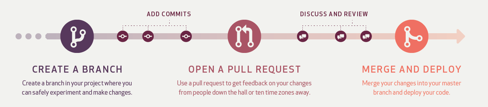

# Arinco Bicep Modules

A collection of opinionated Bicep modules, where functionality was not present or requirements differ from the current Microsoft curated modules.

## Modules

Below is a table containing all published modules.

<!-- Begin Module Table -->

| Module                                         |                                                Version |                                                                                                                                                                                                                                                                            Docs |
| :--------------------------------------------- | -----------------------------------------------------: | ------------------------------------------------------------------------------------------------------------------------------------------------------------------------------------------------------------------------------------------------------------------------------: |
| `api-management/service`                       |  <image src="https://img.shields.io/badge/2.0.2-blue"> |                                             [🦾 Code](https://github.com/arincoau/arinco-bicep-modules/tree/main/modules/api-management/service/main.bicep) ｜ [📃 Readme](https://github.com/arincoau/arinco-bicep-modules/tree/main/modules/api-management/service/README.md) |
| `authorization/policy-assignments`             | <image src="https://img.shields.io/badge/1.0.17-blue"> |                         [🦾 Code](https://github.com/arincoau/arinco-bicep-modules/tree/main/modules/authorization/policy-assignments/main.bicep) ｜ [📃 Readme](https://github.com/arincoau/arinco-bicep-modules/tree/main/modules/authorization/policy-assignments/README.md) |
| `authorization/policy-set-definitions`         |  <image src="https://img.shields.io/badge/1.0.9-blue"> |                 [🦾 Code](https://github.com/arincoau/arinco-bicep-modules/tree/main/modules/authorization/policy-set-definitions/main.bicep) ｜ [📃 Readme](https://github.com/arincoau/arinco-bicep-modules/tree/main/modules/authorization/policy-set-definitions/README.md) |
| `authorization/role-definitions`               | <image src="https://img.shields.io/badge/1.0.18-blue"> |                             [🦾 Code](https://github.com/arincoau/arinco-bicep-modules/tree/main/modules/authorization/role-definitions/main.bicep) ｜ [📃 Readme](https://github.com/arincoau/arinco-bicep-modules/tree/main/modules/authorization/role-definitions/README.md) |
| `automation/automation-accounts`               |  <image src="https://img.shields.io/badge/2.0.1-blue"> |                             [🦾 Code](https://github.com/arincoau/arinco-bicep-modules/tree/main/modules/automation/automation-accounts/main.bicep) ｜ [📃 Readme](https://github.com/arincoau/arinco-bicep-modules/tree/main/modules/automation/automation-accounts/README.md) |
| `compute/virtual-machines`                     |  <image src="https://img.shields.io/badge/1.2.2-blue"> |                                         [🦾 Code](https://github.com/arincoau/arinco-bicep-modules/tree/main/modules/compute/virtual-machines/main.bicep) ｜ [📃 Readme](https://github.com/arincoau/arinco-bicep-modules/tree/main/modules/compute/virtual-machines/README.md) |
| `compute/virtual-machines-scale-sets`          |  <image src="https://img.shields.io/badge/1.2.3-blue"> |                   [🦾 Code](https://github.com/arincoau/arinco-bicep-modules/tree/main/modules/compute/virtual-machines-scale-sets/main.bicep) ｜ [📃 Readme](https://github.com/arincoau/arinco-bicep-modules/tree/main/modules/compute/virtual-machines-scale-sets/README.md) |
| `container-registry/registries`                |  <image src="https://img.shields.io/badge/1.0.2-blue"> |                               [🦾 Code](https://github.com/arincoau/arinco-bicep-modules/tree/main/modules/container-registry/registries/main.bicep) ｜ [📃 Readme](https://github.com/arincoau/arinco-bicep-modules/tree/main/modules/container-registry/registries/README.md) |
| `container-service/managed-clusters`           |  <image src="https://img.shields.io/badge/1.1.1-blue"> |                     [🦾 Code](https://github.com/arincoau/arinco-bicep-modules/tree/main/modules/container-service/managed-clusters/main.bicep) ｜ [📃 Readme](https://github.com/arincoau/arinco-bicep-modules/tree/main/modules/container-service/managed-clusters/README.md) |
| `cosmosdb/database-accounts`                   |  <image src="https://img.shields.io/badge/1.0.6-blue"> |                                     [🦾 Code](https://github.com/arincoau/arinco-bicep-modules/tree/main/modules/cosmosdb/database-accounts/main.bicep) ｜ [📃 Readme](https://github.com/arincoau/arinco-bicep-modules/tree/main/modules/cosmosdb/database-accounts/README.md) |
| `cost-management/budgets`                      |  <image src="https://img.shields.io/badge/1.0.3-blue"> |                                           [🦾 Code](https://github.com/arincoau/arinco-bicep-modules/tree/main/modules/cost-management/budgets/main.bicep) ｜ [📃 Readme](https://github.com/arincoau/arinco-bicep-modules/tree/main/modules/cost-management/budgets/README.md) |
| `data-factory/factories`                       |  <image src="https://img.shields.io/badge/1.0.2-blue"> |                                             [🦾 Code](https://github.com/arincoau/arinco-bicep-modules/tree/main/modules/data-factory/factories/main.bicep) ｜ [📃 Readme](https://github.com/arincoau/arinco-bicep-modules/tree/main/modules/data-factory/factories/README.md) |
| `databricks/access-connector`                  |  <image src="https://img.shields.io/badge/1.0.3-blue"> |                                   [🦾 Code](https://github.com/arincoau/arinco-bicep-modules/tree/main/modules/databricks/access-connector/main.bicep) ｜ [📃 Readme](https://github.com/arincoau/arinco-bicep-modules/tree/main/modules/databricks/access-connector/README.md) |
| `databricks/service`                           |  <image src="https://img.shields.io/badge/1.0.3-blue"> |                                                     [🦾 Code](https://github.com/arincoau/arinco-bicep-modules/tree/main/modules/databricks/service/main.bicep) ｜ [📃 Readme](https://github.com/arincoau/arinco-bicep-modules/tree/main/modules/databricks/service/README.md) |
| `desktop-virtualization/application-groups`    |  <image src="https://img.shields.io/badge/1.0.4-blue"> |       [🦾 Code](https://github.com/arincoau/arinco-bicep-modules/tree/main/modules/desktop-virtualization/application-groups/main.bicep) ｜ [📃 Readme](https://github.com/arincoau/arinco-bicep-modules/tree/main/modules/desktop-virtualization/application-groups/README.md) |
| `desktop-virtualization/host-pools`            |  <image src="https://img.shields.io/badge/1.0.4-blue"> |                       [🦾 Code](https://github.com/arincoau/arinco-bicep-modules/tree/main/modules/desktop-virtualization/host-pools/main.bicep) ｜ [📃 Readme](https://github.com/arincoau/arinco-bicep-modules/tree/main/modules/desktop-virtualization/host-pools/README.md) |
| `desktop-virtualization/scaling-plans`         | <image src="https://img.shields.io/badge/1.0.10-blue"> |                 [🦾 Code](https://github.com/arincoau/arinco-bicep-modules/tree/main/modules/desktop-virtualization/scaling-plans/main.bicep) ｜ [📃 Readme](https://github.com/arincoau/arinco-bicep-modules/tree/main/modules/desktop-virtualization/scaling-plans/README.md) |
| `desktop-virtualization/workspaces`            |  <image src="https://img.shields.io/badge/1.0.3-blue"> |                       [🦾 Code](https://github.com/arincoau/arinco-bicep-modules/tree/main/modules/desktop-virtualization/workspaces/main.bicep) ｜ [📃 Readme](https://github.com/arincoau/arinco-bicep-modules/tree/main/modules/desktop-virtualization/workspaces/README.md) |
| `frontdoor/profiles`                           |  <image src="https://img.shields.io/badge/1.0.6-blue"> |                                                     [🦾 Code](https://github.com/arincoau/arinco-bicep-modules/tree/main/modules/frontdoor/profiles/main.bicep) ｜ [📃 Readme](https://github.com/arincoau/arinco-bicep-modules/tree/main/modules/frontdoor/profiles/README.md) |
| `frontdoor/profiles-endpoints`                 | <image src="https://img.shields.io/badge/1.0.12-blue"> |                                 [🦾 Code](https://github.com/arincoau/arinco-bicep-modules/tree/main/modules/frontdoor/profiles-endpoints/main.bicep) ｜ [📃 Readme](https://github.com/arincoau/arinco-bicep-modules/tree/main/modules/frontdoor/profiles-endpoints/README.md) |
| `insights/resource-health-alerts`              |  <image src="https://img.shields.io/badge/1.0.3-blue"> |                           [🦾 Code](https://github.com/arincoau/arinco-bicep-modules/tree/main/modules/insights/resource-health-alerts/main.bicep) ｜ [📃 Readme](https://github.com/arincoau/arinco-bicep-modules/tree/main/modules/insights/resource-health-alerts/README.md) |
| `insights/service-health-alerts`               |  <image src="https://img.shields.io/badge/1.0.6-blue"> |                             [🦾 Code](https://github.com/arincoau/arinco-bicep-modules/tree/main/modules/insights/service-health-alerts/main.bicep) ｜ [📃 Readme](https://github.com/arincoau/arinco-bicep-modules/tree/main/modules/insights/service-health-alerts/README.md) |
| `key-vault/vaults`                             |  <image src="https://img.shields.io/badge/1.0.7-blue"> |                                                         [🦾 Code](https://github.com/arincoau/arinco-bicep-modules/tree/main/modules/key-vault/vaults/main.bicep) ｜ [📃 Readme](https://github.com/arincoau/arinco-bicep-modules/tree/main/modules/key-vault/vaults/README.md) |
| `key-vault/vaults-secrets`                     |  <image src="https://img.shields.io/badge/1.0.3-blue"> |                                         [🦾 Code](https://github.com/arincoau/arinco-bicep-modules/tree/main/modules/key-vault/vaults-secrets/main.bicep) ｜ [📃 Readme](https://github.com/arincoau/arinco-bicep-modules/tree/main/modules/key-vault/vaults-secrets/README.md) |
| `maintenance/maintenanceconfigurations`        |  <image src="https://img.shields.io/badge/1.0.5-blue"> |               [🦾 Code](https://github.com/arincoau/arinco-bicep-modules/tree/main/modules/maintenance/maintenanceconfigurations/main.bicep) ｜ [📃 Readme](https://github.com/arincoau/arinco-bicep-modules/tree/main/modules/maintenance/maintenanceconfigurations/README.md) |
| `managed-identity/user-assigned-identities`    |  <image src="https://img.shields.io/badge/1.0.9-blue"> |       [🦾 Code](https://github.com/arincoau/arinco-bicep-modules/tree/main/modules/managed-identity/user-assigned-identities/main.bicep) ｜ [📃 Readme](https://github.com/arincoau/arinco-bicep-modules/tree/main/modules/managed-identity/user-assigned-identities/README.md) |
| `management/management-groups`                 |  <image src="https://img.shields.io/badge/1.0.3-blue"> |                                 [🦾 Code](https://github.com/arincoau/arinco-bicep-modules/tree/main/modules/management/management-groups/main.bicep) ｜ [📃 Readme](https://github.com/arincoau/arinco-bicep-modules/tree/main/modules/management/management-groups/README.md) |
| `network/application-gateways`                 |  <image src="https://img.shields.io/badge/2.0.4-blue"> |                                 [🦾 Code](https://github.com/arincoau/arinco-bicep-modules/tree/main/modules/network/application-gateways/main.bicep) ｜ [📃 Readme](https://github.com/arincoau/arinco-bicep-modules/tree/main/modules/network/application-gateways/README.md) |
| `network/application-gateways-firewall-policy` |  <image src="https://img.shields.io/badge/1.0.2-blue"> | [🦾 Code](https://github.com/arincoau/arinco-bicep-modules/tree/main/modules/network/application-gateways-firewall-policy/main.bicep) ｜ [📃 Readme](https://github.com/arincoau/arinco-bicep-modules/tree/main/modules/network/application-gateways-firewall-policy/README.md) |
| `network/azure-firewalls`                      |  <image src="https://img.shields.io/badge/2.1.5-blue"> |                                           [🦾 Code](https://github.com/arincoau/arinco-bicep-modules/tree/main/modules/network/azure-firewalls/main.bicep) ｜ [📃 Readme](https://github.com/arincoau/arinco-bicep-modules/tree/main/modules/network/azure-firewalls/README.md) |
| `network/azure-firewalls-policy`               |  <image src="https://img.shields.io/badge/1.0.2-blue"> |                             [🦾 Code](https://github.com/arincoau/arinco-bicep-modules/tree/main/modules/network/azure-firewalls-policy/main.bicep) ｜ [📃 Readme](https://github.com/arincoau/arinco-bicep-modules/tree/main/modules/network/azure-firewalls-policy/README.md) |
| `network/azure-firewalls-policy-rules`         |  <image src="https://img.shields.io/badge/1.0.6-blue"> |                 [🦾 Code](https://github.com/arincoau/arinco-bicep-modules/tree/main/modules/network/azure-firewalls-policy-rules/main.bicep) ｜ [📃 Readme](https://github.com/arincoau/arinco-bicep-modules/tree/main/modules/network/azure-firewalls-policy-rules/README.md) |
| `network/bastion-hosts`                        |  <image src="https://img.shields.io/badge/1.0.4-blue"> |                                               [🦾 Code](https://github.com/arincoau/arinco-bicep-modules/tree/main/modules/network/bastion-hosts/main.bicep) ｜ [📃 Readme](https://github.com/arincoau/arinco-bicep-modules/tree/main/modules/network/bastion-hosts/README.md) |
| `network/connections`                          |  <image src="https://img.shields.io/badge/1.0.3-blue"> |                                                   [🦾 Code](https://github.com/arincoau/arinco-bicep-modules/tree/main/modules/network/connections/main.bicep) ｜ [📃 Readme](https://github.com/arincoau/arinco-bicep-modules/tree/main/modules/network/connections/README.md) |
| `network/ddos-protection-plans`                |  <image src="https://img.shields.io/badge/1.0.2-blue"> |                               [🦾 Code](https://github.com/arincoau/arinco-bicep-modules/tree/main/modules/network/ddos-protection-plans/main.bicep) ｜ [📃 Readme](https://github.com/arincoau/arinco-bicep-modules/tree/main/modules/network/ddos-protection-plans/README.md) |
| `network/dns-forwarding-rulesets`              |  <image src="https://img.shields.io/badge/1.0.6-blue"> |                           [🦾 Code](https://github.com/arincoau/arinco-bicep-modules/tree/main/modules/network/dns-forwarding-rulesets/main.bicep) ｜ [📃 Readme](https://github.com/arincoau/arinco-bicep-modules/tree/main/modules/network/dns-forwarding-rulesets/README.md) |
| `network/dns-resolvers`                        |  <image src="https://img.shields.io/badge/1.1.1-blue"> |                                               [🦾 Code](https://github.com/arincoau/arinco-bicep-modules/tree/main/modules/network/dns-resolvers/main.bicep) ｜ [📃 Readme](https://github.com/arincoau/arinco-bicep-modules/tree/main/modules/network/dns-resolvers/README.md) |
| `network/express-route-circuits`               |  <image src="https://img.shields.io/badge/2.0.3-blue"> |                             [🦾 Code](https://github.com/arincoau/arinco-bicep-modules/tree/main/modules/network/express-route-circuits/main.bicep) ｜ [📃 Readme](https://github.com/arincoau/arinco-bicep-modules/tree/main/modules/network/express-route-circuits/README.md) |
| `network/express-route-gateways`               |  <image src="https://img.shields.io/badge/1.0.3-blue"> |                             [🦾 Code](https://github.com/arincoau/arinco-bicep-modules/tree/main/modules/network/express-route-gateways/main.bicep) ｜ [📃 Readme](https://github.com/arincoau/arinco-bicep-modules/tree/main/modules/network/express-route-gateways/README.md) |
| `network/fortigate-active-active`              |  <image src="https://img.shields.io/badge/1.0.6-blue"> |                           [🦾 Code](https://github.com/arincoau/arinco-bicep-modules/tree/main/modules/network/fortigate-active-active/main.bicep) ｜ [📃 Readme](https://github.com/arincoau/arinco-bicep-modules/tree/main/modules/network/fortigate-active-active/README.md) |
| `network/front-door-firewall-policy`           |  <image src="https://img.shields.io/badge/1.0.4-blue"> |                     [🦾 Code](https://github.com/arincoau/arinco-bicep-modules/tree/main/modules/network/front-door-firewall-policy/main.bicep) ｜ [📃 Readme](https://github.com/arincoau/arinco-bicep-modules/tree/main/modules/network/front-door-firewall-policy/README.md) |
| `network/ip-groups`                            |  <image src="https://img.shields.io/badge/1.0.3-blue"> |                                                       [🦾 Code](https://github.com/arincoau/arinco-bicep-modules/tree/main/modules/network/ip-groups/main.bicep) ｜ [📃 Readme](https://github.com/arincoau/arinco-bicep-modules/tree/main/modules/network/ip-groups/README.md) |
| `network/local-network-gateways`               |  <image src="https://img.shields.io/badge/1.0.6-blue"> |                             [🦾 Code](https://github.com/arincoau/arinco-bicep-modules/tree/main/modules/network/local-network-gateways/main.bicep) ｜ [📃 Readme](https://github.com/arincoau/arinco-bicep-modules/tree/main/modules/network/local-network-gateways/README.md) |
| `network/network-security-groups`              |  <image src="https://img.shields.io/badge/1.0.2-blue"> |                           [🦾 Code](https://github.com/arincoau/arinco-bicep-modules/tree/main/modules/network/network-security-groups/main.bicep) ｜ [📃 Readme](https://github.com/arincoau/arinco-bicep-modules/tree/main/modules/network/network-security-groups/README.md) |
| `network/network-watchers`                     |  <image src="https://img.shields.io/badge/1.0.2-blue"> |                                         [🦾 Code](https://github.com/arincoau/arinco-bicep-modules/tree/main/modules/network/network-watchers/main.bicep) ｜ [📃 Readme](https://github.com/arincoau/arinco-bicep-modules/tree/main/modules/network/network-watchers/README.md) |
| `network/network-watchers-flow-logs`           |  <image src="https://img.shields.io/badge/1.0.3-blue"> |                     [🦾 Code](https://github.com/arincoau/arinco-bicep-modules/tree/main/modules/network/network-watchers-flow-logs/main.bicep) ｜ [📃 Readme](https://github.com/arincoau/arinco-bicep-modules/tree/main/modules/network/network-watchers-flow-logs/README.md) |
| `network/private-dns-link`                     |  <image src="https://img.shields.io/badge/1.0.6-blue"> |                                         [🦾 Code](https://github.com/arincoau/arinco-bicep-modules/tree/main/modules/network/private-dns-link/main.bicep) ｜ [📃 Readme](https://github.com/arincoau/arinco-bicep-modules/tree/main/modules/network/private-dns-link/README.md) |
| `network/private-dns-zones`                    |  <image src="https://img.shields.io/badge/1.0.5-blue"> |                                       [🦾 Code](https://github.com/arincoau/arinco-bicep-modules/tree/main/modules/network/private-dns-zones/main.bicep) ｜ [📃 Readme](https://github.com/arincoau/arinco-bicep-modules/tree/main/modules/network/private-dns-zones/README.md) |
| `network/private-endpoints`                    |  <image src="https://img.shields.io/badge/2.2.3-blue"> |                                       [🦾 Code](https://github.com/arincoau/arinco-bicep-modules/tree/main/modules/network/private-endpoints/main.bicep) ｜ [📃 Readme](https://github.com/arincoau/arinco-bicep-modules/tree/main/modules/network/private-endpoints/README.md) |
| `network/route-tables`                         |  <image src="https://img.shields.io/badge/1.0.8-blue"> |                                                 [🦾 Code](https://github.com/arincoau/arinco-bicep-modules/tree/main/modules/network/route-tables/main.bicep) ｜ [📃 Readme](https://github.com/arincoau/arinco-bicep-modules/tree/main/modules/network/route-tables/README.md) |
| `network/virtual-hubs-route-tables`            |  <image src="https://img.shields.io/badge/1.0.4-blue"> |                       [🦾 Code](https://github.com/arincoau/arinco-bicep-modules/tree/main/modules/network/virtual-hubs-route-tables/main.bicep) ｜ [📃 Readme](https://github.com/arincoau/arinco-bicep-modules/tree/main/modules/network/virtual-hubs-route-tables/README.md) |
| `network/virtual-hubs-vnet-connections`        |  <image src="https://img.shields.io/badge/1.0.2-blue"> |               [🦾 Code](https://github.com/arincoau/arinco-bicep-modules/tree/main/modules/network/virtual-hubs-vnet-connections/main.bicep) ｜ [📃 Readme](https://github.com/arincoau/arinco-bicep-modules/tree/main/modules/network/virtual-hubs-vnet-connections/README.md) |
| `network/virtual-network-gateways`             | <image src="https://img.shields.io/badge/2.0.10-blue"> |                         [🦾 Code](https://github.com/arincoau/arinco-bicep-modules/tree/main/modules/network/virtual-network-gateways/main.bicep) ｜ [📃 Readme](https://github.com/arincoau/arinco-bicep-modules/tree/main/modules/network/virtual-network-gateways/README.md) |
| `network/virtual-networks`                     | <image src="https://img.shields.io/badge/1.0.12-blue"> |                                         [🦾 Code](https://github.com/arincoau/arinco-bicep-modules/tree/main/modules/network/virtual-networks/main.bicep) ｜ [📃 Readme](https://github.com/arincoau/arinco-bicep-modules/tree/main/modules/network/virtual-networks/README.md) |
| `network/virtual-networks-peerings`            |  <image src="https://img.shields.io/badge/1.0.2-blue"> |                       [🦾 Code](https://github.com/arincoau/arinco-bicep-modules/tree/main/modules/network/virtual-networks-peerings/main.bicep) ｜ [📃 Readme](https://github.com/arincoau/arinco-bicep-modules/tree/main/modules/network/virtual-networks-peerings/README.md) |
| `network/virtual-wans`                         |  <image src="https://img.shields.io/badge/1.0.4-blue"> |                                                 [🦾 Code](https://github.com/arincoau/arinco-bicep-modules/tree/main/modules/network/virtual-wans/main.bicep) ｜ [📃 Readme](https://github.com/arincoau/arinco-bicep-modules/tree/main/modules/network/virtual-wans/README.md) |
| `network/vpn-gateways`                         |  <image src="https://img.shields.io/badge/1.0.3-blue"> |                                                 [🦾 Code](https://github.com/arincoau/arinco-bicep-modules/tree/main/modules/network/vpn-gateways/main.bicep) ｜ [📃 Readme](https://github.com/arincoau/arinco-bicep-modules/tree/main/modules/network/vpn-gateways/README.md) |
| `network/vpn-sites`                            |  <image src="https://img.shields.io/badge/1.0.5-blue"> |                                                       [🦾 Code](https://github.com/arincoau/arinco-bicep-modules/tree/main/modules/network/vpn-sites/main.bicep) ｜ [📃 Readme](https://github.com/arincoau/arinco-bicep-modules/tree/main/modules/network/vpn-sites/README.md) |
| `operational-insights/workspaces`              |  <image src="https://img.shields.io/badge/2.0.3-blue"> |                           [🦾 Code](https://github.com/arincoau/arinco-bicep-modules/tree/main/modules/operational-insights/workspaces/main.bicep) ｜ [📃 Readme](https://github.com/arincoau/arinco-bicep-modules/tree/main/modules/operational-insights/workspaces/README.md) |
| `postgresql/flexible-servers`                  |  <image src="https://img.shields.io/badge/1.1.2-blue"> |                                   [🦾 Code](https://github.com/arincoau/arinco-bicep-modules/tree/main/modules/postgresql/flexible-servers/main.bicep) ｜ [📃 Readme](https://github.com/arincoau/arinco-bicep-modules/tree/main/modules/postgresql/flexible-servers/README.md) |
| `recovery-services/vaults`                     |  <image src="https://img.shields.io/badge/1.1.7-blue"> |                                         [🦾 Code](https://github.com/arincoau/arinco-bicep-modules/tree/main/modules/recovery-services/vaults/main.bicep) ｜ [📃 Readme](https://github.com/arincoau/arinco-bicep-modules/tree/main/modules/recovery-services/vaults/README.md) |
| `samples/hello-world`                          |  <image src="https://img.shields.io/badge/1.0.1-blue"> |                                                   [🦾 Code](https://github.com/arincoau/arinco-bicep-modules/tree/main/modules/samples/hello-world/main.bicep) ｜ [📃 Readme](https://github.com/arincoau/arinco-bicep-modules/tree/main/modules/samples/hello-world/README.md) |
| `security/defender-for-cloud`                  |  <image src="https://img.shields.io/badge/2.0.1-blue"> |                                   [🦾 Code](https://github.com/arincoau/arinco-bicep-modules/tree/main/modules/security/defender-for-cloud/main.bicep) ｜ [📃 Readme](https://github.com/arincoau/arinco-bicep-modules/tree/main/modules/security/defender-for-cloud/README.md) |
| `security/sentinel`                            |  <image src="https://img.shields.io/badge/1.0.9-blue"> |                                                       [🦾 Code](https://github.com/arincoau/arinco-bicep-modules/tree/main/modules/security/sentinel/main.bicep) ｜ [📃 Readme](https://github.com/arincoau/arinco-bicep-modules/tree/main/modules/security/sentinel/README.md) |
| `sql/databases`                                |  <image src="https://img.shields.io/badge/1.1.4-blue"> |                                                               [🦾 Code](https://github.com/arincoau/arinco-bicep-modules/tree/main/modules/sql/databases/main.bicep) ｜ [📃 Readme](https://github.com/arincoau/arinco-bicep-modules/tree/main/modules/sql/databases/README.md) |
| `sql/elastic-pool`                             |  <image src="https://img.shields.io/badge/1.0.4-blue"> |                                                         [🦾 Code](https://github.com/arincoau/arinco-bicep-modules/tree/main/modules/sql/elastic-pool/main.bicep) ｜ [📃 Readme](https://github.com/arincoau/arinco-bicep-modules/tree/main/modules/sql/elastic-pool/README.md) |
| `sql/managed-instance`                         |  <image src="https://img.shields.io/badge/1.0.8-blue"> |                                                 [🦾 Code](https://github.com/arincoau/arinco-bicep-modules/tree/main/modules/sql/managed-instance/main.bicep) ｜ [📃 Readme](https://github.com/arincoau/arinco-bicep-modules/tree/main/modules/sql/managed-instance/README.md) |
| `sql/servers`                                  |  <image src="https://img.shields.io/badge/2.1.1-blue"> |                                                                   [🦾 Code](https://github.com/arincoau/arinco-bicep-modules/tree/main/modules/sql/servers/main.bicep) ｜ [📃 Readme](https://github.com/arincoau/arinco-bicep-modules/tree/main/modules/sql/servers/README.md) |
| `storage/storage-accounts`                     |  <image src="https://img.shields.io/badge/3.0.2-blue"> |                                         [🦾 Code](https://github.com/arincoau/arinco-bicep-modules/tree/main/modules/storage/storage-accounts/main.bicep) ｜ [📃 Readme](https://github.com/arincoau/arinco-bicep-modules/tree/main/modules/storage/storage-accounts/README.md) |
| `virtual-machine-images/image-templates`       |  <image src="https://img.shields.io/badge/2.0.2-blue"> |             [🦾 Code](https://github.com/arincoau/arinco-bicep-modules/tree/main/modules/virtual-machine-images/image-templates/main.bicep) ｜ [📃 Readme](https://github.com/arincoau/arinco-bicep-modules/tree/main/modules/virtual-machine-images/image-templates/README.md) |

<!-- End Module Table -->

# Documentation

After some guidance or some more information, check out the [wiki](https://github.com/arincoau/arinco-bicep-modules/wiki).

# Contribute

To contribute, please refer to [Contributing to Arinco Bicep modules](./CONTRIBUTING.md) for information. Please ensure you follow the GitHub Flow branching strategy:

- Create a new feature branch
- Commit your changes
- Raise a pull request and code owners will be automatically assigned to review your pull request
- Merge Code

Want to contribute but can't install and configure all the required software on your local machine, check out [codespaces](https://github.com/arincoau/arinco-bicep-modules/wiki/Codespace)

