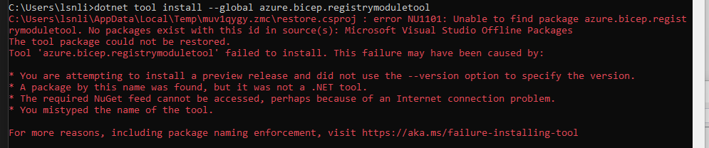

# Troubleshooting for common problems that might occur during the install/development process

Please update this file with any errors you encounter.

## Prerequisites Installation

### Bicep Registry Modules

In rare occasions where VS studio was installed before .NET framework, the nuget package source configuration can be pointing to the wrong area. In which case, you will see the following error:

To resolve this, navigate to the nuget options configuration within VS studio as per following diagram:

Add the entry for Nuget API as per the following diagram. The latest configuration is available at this [link](https://docs.microsoft.com/en-us/nuget/consume-packages/configuring-nuget-behavior)

